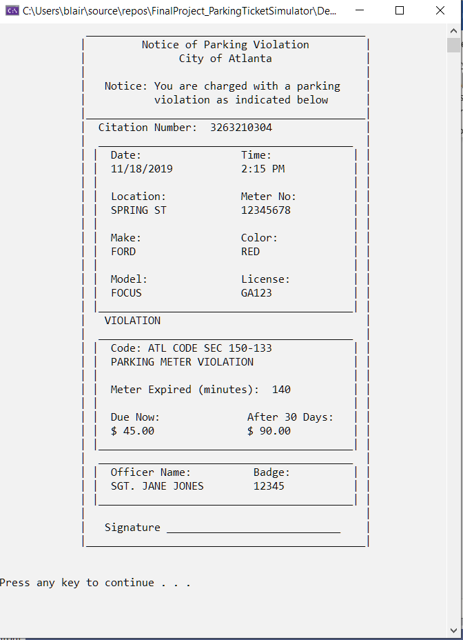

# Parking_Ticket_Simulator_Final_Project-Cpp-2
The program demonstrates multiples classes collaborating to produce a parking ticket issued by a police officer based on the time the car has been parked in comparison to the amount of time paid on the meter. The program calculates the amount of the fine based on the minutes the car has been illegally parked.

## Documentation

## Programming Strategy:
In the program, a police officer will be asked to enter a valid name and badge number. Next, the program will ask the police officer for the minutes the car has been parked and the minutes paid at the meter. If the car is illegally parked, the police officer will be asked to enter the make, model, license of the car. Once valid information has been entered, a parking ticket object will be created. The parking ticket object will ask the police officer for the location of the violation and the meter number. The parking ticket object will calculate the fine and display the parking ticket.

## Final Display

